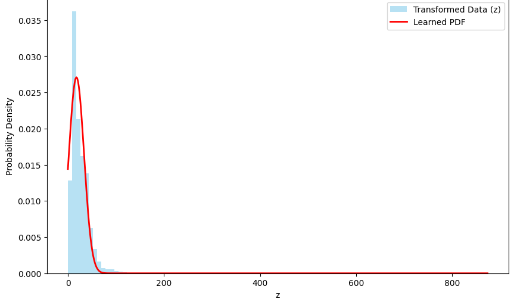

# 🌫️ Air Quality PDF Estimation via NO₂ Nonlinear Transformation

> Estimating probability density functions from Indian air quality data using roll-number-dependent nonlinear transformations and least-squares curve fitting.

---

## 📌 Overview

This project extracts **NO₂ concentration measurements** from a real-world Indian air quality dataset, applies a personalized nonlinear transformation, and fits a Gaussian-like PDF model to the transformed distribution using nonlinear least squares.

The analysis demonstrates how a simple sinusoidal perturbation can reshape a raw pollution distribution — and how well a parametric model can recover its structure.

---

## 📂 Dataset

**[India Air Quality Data](https://www.kaggle.com/datasets/shrutibhargava94/india-air-quality-data)** — pollution measurements from monitoring stations across India.

Pollutants included:

| Pollutant | Description |
|-----------|-------------|
| **NO₂** | Nitrogen Dioxide *(used in this project)* |
| PM2.5 | Fine particulate matter |
| PM10 | Coarse particulate matter |
| SO₂ | Sulphur Dioxide |
| CO | Carbon Monoxide |
| O₃ | Ozone |

---

## 🎯 Objective

1. Extract raw **NO₂** measurements from the dataset
2. Apply a **roll-number-dependent nonlinear transformation**
3. Estimate the **PDF** of the transformed variable
4. Fit a parametric Gaussian model using **nonlinear least squares**
5. Visualize the empirical histogram vs. the fitted curve

---

## ▶️ Usage

```python
import maths

maths.run_assignment(102303256, "india-air-quality-data.csv")
```

The script will automatically:
- Load and preprocess the dataset
- Compute roll-number-derived parameters
- Apply the nonlinear transformation
- Estimate and fit the PDF
- Render the visualization

---

## 🔢 Mathematical Formulation

### Transformation

Let $x$ denote the raw NO₂ concentration. The transformed variable $z$ is defined as:

$$z = x + a_r \sin(b_r x)$$

where the parameters are derived from the university roll number $r$:

$$a_r = 0.5 \cdot (r \mod 7), \qquad b_r = 0.3 \cdot ((r \mod 5) + 1)$$

### PDF Model

The fitted probability density function takes the form:

$$f(z) = c \cdot \exp\!\left(-\lambda (z - \mu)^2\right)$$

| Symbol | Role |
|--------|------|
| $c$ | Scaling / normalization constant |
| $\lambda$ | Spread (inverse-variance) parameter |
| $\mu$ | Center of the distribution |

Parameters are learned via **nonlinear least squares** fitting to the empirical histogram.

---

## 📊 Fitted Parameters

| Parameter | Value |
|-----------|-------|
| $a_r$ | `3.000` |
| $b_r$ | `0.600` |
| $c$ | `0.027100` |
| $\lambda$ | `0.001992` |
| $\mu$ | `17.798141` |

---

## 📈 Visualization

The plot below shows the **empirical histogram** of the transformed variable $z$ alongside the **fitted PDF** (red curve).



The close agreement between the histogram and the fitted curve confirms that the Gaussian model is a reasonable approximation of the transformed NO₂ distribution.

---

## 🛠️ Dependencies

```bash
pip install numpy pandas scipy matplotlib
```

---

## 📁 Project Structure

```
.
├── maths.py                  # Core transformation + fitting logic
├── india-air-quality-data.csv
├── PDF.png                   # Output visualization
└── README.md
```

---

## 📜 License

This project is submitted as part of a university assignment. Dataset credit: [Shruti Bhargava on Kaggle](https://www.kaggle.com/datasets/shrutibhargava94/india-air-quality-data).
